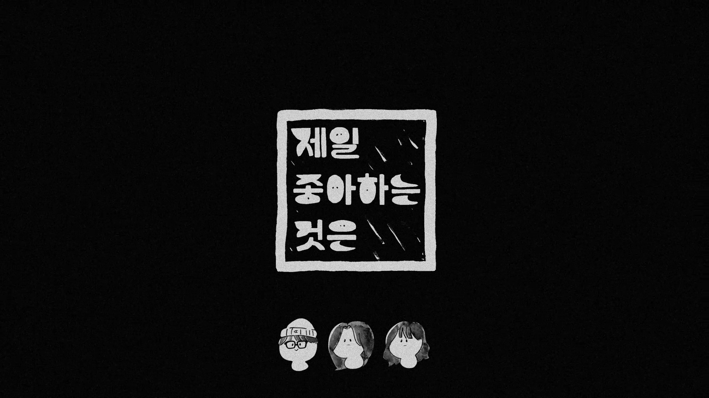

# 🌕 <b>Moon Child   </b>

## 👋🏻 2023 글로벌미디어학부 졸업전시 팀[제일 좋아하는 것은]의 <MoonChild> 개발 레포입니다      

✵ [졸업전시회_제안서](resource/%EC%A1%B8%EC%97%85%EC%A0%84%EC%8B%9C%ED%9A%8C_%EC%A0%9C%EC%95%88%EC%84%9C_%ED%8C%80_%EC%A0%9C%EC%A2%8B%EC%9D%80.pdf졸업전시회_제안서_팀_제좋은.png)   
✵ [졸업전시회_중간피드백](resource/%EC%A0%9C%EC%9D%BC%EC%A2%8B%EC%95%84%ED%95%98%EB%8A%94%EA%B2%83%EC%9D%80_%ED%94%BC%EB%93%9C%EB%B0%B1%ED%96%89%EC%82%AC_%EC%9E%90%EB%A3%8C.pdf)   
✵ [졸업전시회_기획발표](resource/%EA%B8%B0%ED%9A%8D%EB%B0%9C%ED%91%9C_%EC%A0%9C%EC%A2%8B%EC%9D%80_%EC%B5%9C%EC%A2%85.pdf)   
✵ [졸업전시회_회고발표](resource/%EC%A0%9C%EC%A2%8B%EC%9D%80%20%ED%9A%8C%EA%B3%A0%EB%B0%9C%ED%91%9C.pdf)

### 🎥 <b>Game Trailer</b>

### 🌈 <b>작품주제</b> |  프리즘 속 여정을 표현한 2인 협력 스토리텔링 게임    
`#영화같은` `#게임` `#프리즘` `#인터랙티브` `#경험` `#스토리텔링`

> <i>Medium is the Message.</i> 

우리는 <b>관계</b>에 집중합니다.   
빛이 있어야 색이 보이듯, 관계를 통해 우리의 원래 ‘색’을 찾습니다.   
현대인의 가벼운 관계 맺음에서 탈피하고 ‘우리’의 중요성을 깨닫길 원합니다.

### 👥 <b>팀원소개 ୧( “̮ )୨ ✧</b>

- 김종호 : 팀장 및 개발 
- 최시은 : 개발 
- 조재인 : 디자인 

## 🖌 <b>Tools</b>   
  

---

##### *© 2023. 제일 좋아하는 것은 All rights reserved.*
